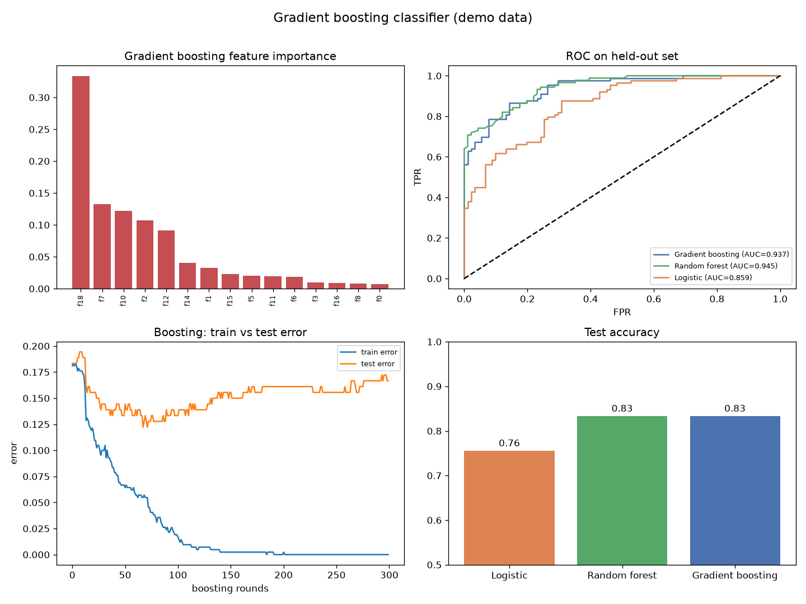

# Gradient Boosting Classifier

Random forests average many independent trees. Gradient boosting does the opposite — it builds trees in sequence, each one fixing the mistakes of the last. That single change is why boosting (XGBoost, LightGBM) wins so many tabular-data competitions, and why it needs more care not to overfit.

## Why This Matters

Boosting turns a crowd of weak learners into a strong one by focusing each new tree on the residual errors so far. The upside is accuracy that usually edges out a random forest; the price is that boosting *can* keep fitting noise if you let it run too long. Watching the train and test error diverge over boosting rounds is the clearest picture of that trade-off in all of machine learning.

## How It Works

1. Fit shallow trees one after another, each trained on the current errors, shrunk by a learning rate.
2. Track feature importance, held-out ROC, and error vs boosting rounds.
3. Compare against a random forest and logistic-regression baseline.

## What the Demo Shows



The demo trains gradient boosting on synthetic data and shows its feature importances, an ROC curve that edges out the baselines, and the tell-tale train/test error curves — test error bottoms out and then creeps up as boosting overfits.

## Run It

```bash
pip install -r requirements.txt
python demo.py
```

> Demonstrated on synthetic data, so it's fully reproducible with no external downloads.
